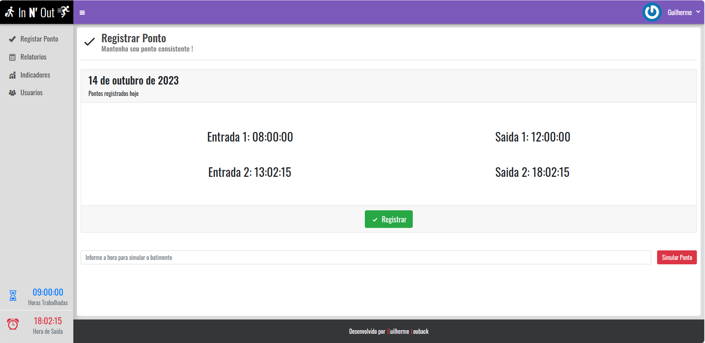

# Livro de Ponto - Aplicação de Registro de Trabalho

## Descrição
O Livro de Ponto é uma aplicação web que permite aos funcionários registrar suas horas de trabalho de forma eficiente e precisa. Este aplicativo foi projetado para simplificar o processo de controle de ponto, fornecendo uma solução digital confiável.

## Recursos Principais
- Registro de entrada e saída de funcionários.
- Cálculo automático de horas trabalhadas.
- Histórico de registros de ponto.
- Painel de administração para gerenciamento de usuários e permissões.
- Visualização de relatórios e exportação de dados.

## Capturas de Tela

## Como Usar
1. Faça o download ou clone o repositório do projeto.
2. Configure um ambiente de desenvolvimento de acordo com as instruções do arquivo `db.sql` na pasta `extra`.
3. Crie um arquivo `env.ini`.
4. Cofigure a conexao com DB(MYSQL) na raiz da aplicacao com host, username, password, database.
5. Emule usando XAMPP ou MAMP e acesse o aplicativo em seu navegador.
6. Faça login com suas credenciais ou crie uma nova conta de usuário.
7. Comece a registrar suas entradas e saídas de trabalho.

## Tecnologias Utilizadas
- **Backend:** PHP
- **Frontend:** PHP, JavaScript
- **Estilos:** CSS, Bootstrap

## Contribuição
Sinta-se à vontade para contribuir para o desenvolvimento deste projeto. Você pode fazer isso criando issues, sugerindo melhorias, ou enviando pull requests. Consulte as diretrizes de contribuição no arquivo `CONTRIBUTING.md`.

## Autor
Guilherme Louback de Virgilio
guilherme_lou@hotmail.com

